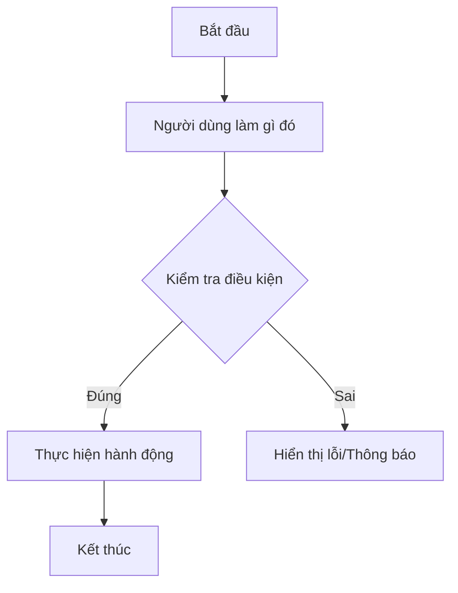

# Business Requirements Document (BRD) - duantoan

Tài liệu này xác định các yêu cầu nghiệp vụ chi tiết và luồng hoạt động chính của hệ thống. AI Agent sẽ dựa vào đây để thiết kế cấu trúc dữ liệu và logic code.

---

## 1. Yêu Cầu Chức Năng (Functional Requirements)

### 1.1. Module A: [Tên Module]
*Mô tả các chức năng chi tiết của Module A.*
- **Yêu cầu 1:** Hệ thống phải cho phép người dùng...
- **Yêu cầu 2:** Khi người dùng click vào..., hệ thống phải hiển thị...
- **Yêu cầu 3:** Logic xử lý tính toán phải...

### 1.2. Module B: [Tên Module]
- **Yêu cầu 1:** ...
- **Yêu cầu 2:** ...

---

## 2. Yêu Cầu Phi Chức Năng (Non-Functional Requirements)

- **Performance (Hiệu năng):** Thời gian phản hồi trang phải dưới 1s.
- **UI/UX (Trải nghiệm):** Theo chuẩn thiết kế hiện đại, responsive hoàn toàn trên di động và tablet.
- **Security (Bảo mật):** Toàn bộ dữ liệu nhạy cảm hoặc API Key phải lưu ở client (localStorage) hoặc mã hóa khi lưu trữ.
- **Compatibility (Tương thích):** Chạy mượt mà trên Chrome, Safari, Edge và các trình duyệt di động thông dụng.

---

## 3. Kiến Trúc Dữ Liệu & State Management

- **Database / LocalStorage Schema:**
  - Mô tả cấu trúc các bảng hoặc cấu trúc JSON lưu trữ.
- **Global State (Nếu có):**
  - Quản lý state bằng thư viện gì (Zustand, Redux, Context API).
  - Các state cần đồng bộ toàn ứng dụng.

---

## 4. Luồng Nghiệp Vụ Chính (Key User Workflows)

*(Thay đổi biểu đồ Mermaid trên cho phù hợp với luồng chính của dự án)*
